**Searchable whiteboards for research. Every picture, sticky, and spreadsheet cell is indexed.**

Whiteboards beat walls of text. But FigJam and Miro can't search the images on them, and images are as important as text collection.

🌐 Live demo coming at **YOUR_DOMAIN/demo** *(in the works)*.

---

## Why this exists

I use whiteboards a lot for research — nobody wants to read a document (ie: traditional research). Admittedly, I like visuals better for much of my research, too.

But FigJam, Miro, et al. don't have the kind of searchability you get with documents. And I supplement research with images, those images don't turn up in search either. A picture of a jellyfish, in FigJam or Miro, is invisible to search.

So Station 8 is my personal fix. Drop an image on a board and OCR runs in your browser — words printed inside the image become findable immediately. Tag the image with alt text and that's searchable too.

It also actually takes you to the match instead of hoping that you find it. Cmd+K, type, the canvas zooms to each hit one at a time. Even threw a glow around it so you can't miss it.

I pulled native spreadsheets and Google Docs/Sheets into the same workspace too, so I don't need to work across several tabs.

I named it Station 8, because I was researching marine field stations when I decided to make this.

---

## It's free, and images are searchable

| Tool | Cost | Image search | Native sheets | Jumps to match |
|:---|:---|:---:|:---:|:---:|
| **Station 8** | **free** | ✓ | ✓ | ✓ |
| AFFiNE | $6.75/mo | ✗ | ✗ | ✗ |
| Obsidian | free | plugin | ✗ | ✗ |
| FigJam | free → paid | ✗ | ✗ | ✗ |
| Miro | free → paid | enterprise | ✗ | ✗ |
| Heptabase | $8/mo | ✗ | ✗ | ✗ |
| Notion AI | $10/user/mo | ✗ | ✗ | ✗ |

**Tradeoff for being free:** search uses TF-IDF, not LLM embeddings. It finds what you typed or what was OCR'd — it won't guess that "jellyfish" relates to "sea animals". Tag images with alt text for concept matches. Upside: fast, private, runs on tiny hardware, never sends your data anywhere.

One password gate, two modes: owner reads and writes, visitor is read-only with scoped share links per board.

---

## How it looks


---

## Stack

- **Canvas:** [tldraw](https://tldraw.dev) — the entire project leans on it
- **OCR:** [Tesseract.js](https://tesseract.projectnaptha.com/), running in the browser
- **Native sheets:** [react-spreadsheet](https://github.com/iddan/react-spreadsheet)
- **Search ranking:** scikit-learn (TF-IDF cosine similarity)
- **Backend:** Flask (Python, single-file `server.py`)
- **Storage:** Supabase (JSON state + image bucket)
- **Hosting:** Vercel (frontend) / Render (backend, free tier)

## Local development

```bash
# Backend (terminal 1)
export FLASK_SECRET_KEY=dev-secret
python server.py

# Frontend (terminal 2)
cd frontend
npm install
npm run dev
```

Visit `http://127.0.0.1:5173`.

If you don't set `OWNER_PASSWORD` and `VISITOR_PASSWORD`, local dev will prompt you to create both in the browser on first run.

## Acknowledgements

- **[tldraw](https://tldraw.dev)** for the load-bearing canvas
- **[react-spreadsheet](https://github.com/iddan/react-spreadsheet)** for the sheet view
- **[Tesseract.js](https://tesseract.projectnaptha.com/)** for browser-side OCR
- **scikit-learn** for the search ranking
- The [asciiart.eu ASCII Horizon](https://www.asciiart.eu/animations/ascii-horizon) animation, which inspired the header

---

<details>
<summary><strong>Deployment notes (for self-hosting)</strong></summary>

### Backend (Render)

1. Create a Render web service from this repo.
2. Mount a persistent disk at `/var/data`.
3. Environment variables:
   - `OWNER_PASSWORD=<workspace-password>`
   - `VISITOR_PASSWORD=<visitor-password>`
   - `FLASK_SECRET_KEY=<long-random-secret>`
   - `CORS_ALLOWED_ORIGINS=https://your-domain.com`
   - `SUPABASE_URL` and `SUPABASE_KEY`
4. Render runs `python server.py`.

### Frontend (Vercel)

1. Connect the repo to Vercel.
2. Set `VITE_API_URL=<your-render-url>`.

</details>
