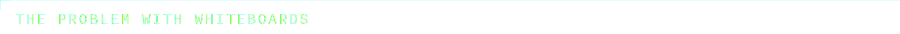
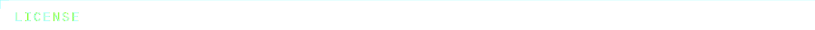

<div align="center">

[](https://github.com/Drakula5000/station8/actions/workflows/ci.yml)
[](./LICENSE)
[](https://www.python.org/)
[](https://tldraw.dev/)

<br>
<br>

Searchable whiteboards for research. Every picture, sticky, and spreadsheet cell is indexed.<br>
Whiteboards beat walls of text. But FigJam and Miro can't search the images on them... and images are worth 1k words.

</div>

<br>



I use whiteboards for research, because people prefer it to reading pages of analysis and findings. But FigJam, Miro, et al. don't have the kind of searchability you get with documents. So a photo from a slide at a conference or a picture of a jellyfish is invisible to their search.

Station 8 fixes that for me -- a searchable database for everything in my canvas-based research. Drop an image on a board and OCR runs in your browser, words printed inside the image become findable immediately. Tag the image with alt text and that's searchable too. Stickies, docs, spreadsheet cells, all of it indexed in one place.

The search results also take you directly to the search hits, zooming your camera for you, and lighting up your find. Search specific boards or the whole database, our search will take you on the guided tour of your hits.

You can create or import Google Docs and Sheets directly into the same workspace, so people can search your entire research database in one spot.

Station 8 is a free (or almost-free if depending on your usage) way to show-off your research and how you think. You could put a link in your résumé or recruiter outreach so they can see your research and passion on a relevant topic. The economy and labor market are tough right now, and I want you to shine without sacrificing meals.

<div align="center">
<a href="https://drakula5000.github.io/station8/demo" style="color: #66ffff; text-decoration: none; font-family: 'Courier New', monospace; font-size: 11px; letter-spacing: 0.1em;">→ TRY THE LIVE DEMO</a>
</div>

<br>


<br>


What I needed, and most independent researchers do too: a workspace that lives online for free, holds everything in one place (canvas, docs, sheets), and lets me find anything in it, including text inside images. Nothing else covers all four.

| tool | free online hosting | infinite canvas | canvas + docs + sheets | searches inside images | navigates to result |
|:---|:---:|:---:|:---:|:---:|:---:|
| **Station 8** | **✓** | ✓ | ✓ | ✓ | ✓ |
| FigJam | ✓ | ✓ | ✗ | ✗ | ✗ |
| Miro | ✓ | ✓ | ✗ | enterprise only | ✗ |
| AFFiNE | ✓ | ✓ | ✗ | ✗ | ✗ |
| Obsidian | ✗ local-only | ✗ | ✗ | plugin | ✗ |
| Heptabase | ✗ $8.99/mo | ✓ | ✗ | ✗ | ✗ |
| Notion | ✓ | ✗ | ✗ | ✗ | ✗ |

### The trade-off for being free

Search uses TF-IDF, not LLM embeddings. It finds exact matches and statistically related terms based on what's in your corpus -- so "sea creatures" can surface jellyfish content if that's what your boards talk about. It won't make conceptual leaps a language model would, but it's fast, private, runs on tiny hardware, and never sends your data anywhere.

One login, two access levels: the owner password lets you edit everything, the visitor password is read-only. You can share individual boards with a private link too.

<br>


- **Frontend:** [tldraw](https://tldraw.dev) (canvas), [Tesseract.js](https://tesseract.projectnaptha.com/) (OCR), [react-spreadsheet](https://github.com/iddan/react-spreadsheet) (native sheets)
- **Backend:** Flask (Python), scikit-learn (TF-IDF search ranking)
- **Storage & hosting:** Supabase (data + image bucket), Vercel (frontend), Render (backend, free tier)

<br>


```bash
# Backend (terminal 1)
export FLASK_SECRET_KEY=dev-secret
python server.py

# Frontend (terminal 2)
cd frontend
npm install
npm run dev
```

Visit `http://127.0.0.1:5173`.

If you don't set `OWNER_PASSWORD` and `VISITOR_PASSWORD`, local dev will prompt you to create both in the browser on first run.

<details>
<summary><strong>Adding Google Docs and Sheets to your workspace</strong></summary>

<br>

Google Docs and Sheets are first-class document types in Station 8 — they live in the sidebar alongside boards, embed directly in the workspace, and their content is fully searchable. To use them, you connect your Google account via OAuth. Once connected, any Doc or Sheet you have access to can be added and searched, and you can share them all to visitors in one click.

You'll need a Google Cloud OAuth client (free, ~5 min). The order matters — Google blocks each step until the previous one is done.

**1. Create a Google Cloud project.**
Open [console.cloud.google.com](https://console.cloud.google.com/) (sign in with the Google account you want Station 8 to read from). Top bar → "Select a project" → **NEW PROJECT** → name it `Station 8` → CREATE. Wait ~10 seconds, then switch into it from the same dropdown.

**2. Enable the three APIs Station 8 uses.**
Left sidebar (☰) → **APIs & Services → Library**. Search and enable each separately:
- **Google Drive API** → click result → ENABLE → back arrow
- **Google Docs API** → ENABLE → back arrow
- **Google Sheets API** → ENABLE → back arrow

**3. Configure the OAuth consent screen.**
Left sidebar → **APIs & Services → OAuth consent screen** (in Google's newer UI this section is called **Google Auth Platform → Branding**, same thing). Pick **External** as the user type → CREATE.

> "External" sounds scary but for self-hosting it just means non-Workspace Google accounts can authenticate. It doesn't make your data public — it only controls who can sign in.

Fill in: app name `Station 8`, your email as "User support email", your email as "Developer contact". Click SAVE AND CONTINUE through every step (Scopes, Test users, Summary) — you can leave them all blank for now.

**4. Add yourself (and anyone else who'll use this Station 8) as a Test user.**
Your OAuth app stays in **Testing** mode forever — you do NOT need to publish it or go through Google's app verification for personal/team self-hosting. But Testing mode means **only emails listed under Test users can sign in**. Up to 100 emails allowed.

Go to **OAuth consent screen → Audience** tab (or scroll down to "Test users" in the older UI) → **+ ADD USERS** → paste your Google email → ADD → SAVE. Add any other Station 8 users the same way. **If you skip this, you'll get an "Access blocked: Station 8 has not completed verification" error when you try to sign in.**

**5. Create the OAuth client credentials.**
Left sidebar → **APIs & Services → Credentials → + CREATE CREDENTIALS → OAuth client ID**.
- Application type: **Web application**
- Name: `Station 8 Web`
- Under **Authorized redirect URIs**, click "+ ADD URI" twice and paste:
  - `http://127.0.0.1:5001/api/google/callback` (local dev)
  - `https://<your-api-domain>/api/google/callback` (prod, if self-hosting)
- CREATE.

**6. Copy the Client ID and Client secret** from the popup. The secret is only shown once — copy it now or you'll have to regenerate.

**7. Drop the credentials in `.env` at the project root** (gitignored — never commit this file):

```bash
GOOGLE_CLIENT_ID=<your-client-id>
GOOGLE_CLIENT_SECRET=<your-client-secret>
GOOGLE_OAUTH_REDIRECT_URI=http://127.0.0.1:5001/api/google/callback
```

Restart the dev server (`.env` is loaded by `start.sh` on launch — running server won't pick it up). Click **Connect Google** in the sidebar footer → sign in → grant Drive access → done. Creating a new Doc or Sheet inside Station 8 now creates a real file in your Drive automatically.

</details>

<br>
<br>


[tldraw](https://tldraw.dev), [Tesseract.js](https://tesseract.projectnaptha.com/), and [react-spreadsheet](https://github.com/iddan/react-spreadsheet) do the heavy lifting.

<br>


I vibecoded this app. AI transparency matters to understand security, safety, and the longevity of a software. You might ask your own AI agents or, even better, an engineering friend to review this code before you use it.

<br>



MIT. See [LICENSE](./LICENSE).

tldraw requires its own license key for production use. A free 100-day trial and a free hobby license (non-commercial, shows a watermark) are available at [tldraw.dev/community/license](https://tldraw.dev/community/license).

---

<details>
<summary><strong>Self-Hosting</strong></summary>

### Backend (Render)

1. Create a Render web service from this repo.
2. Mount a persistent disk at `/var/data`.
3. Environment variables:
   - `OWNER_PASSWORD=<workspace-password>`
   - `VISITOR_PASSWORD=<visitor-password>`
   - `FLASK_SECRET_KEY=<long-random-secret>`
   - `CORS_ALLOWED_ORIGINS=https://your-domain.com`
   - `SUPABASE_URL=<your-supabase-url>`
   - `SUPABASE_KEY=<your-supabase-key>`
   - *(optional, only if you want the "Connect Google" feature)*
     - `GOOGLE_CLIENT_ID=<your-client-id>`
     - `GOOGLE_CLIENT_SECRET=<your-client-secret>`
     - `GOOGLE_OAUTH_REDIRECT_URI=https://<your-api-domain>/api/google/callback`
     - `FRONTEND_URL=https://<your-frontend-domain>` (where Google bounces users back to after auth)
4. Render runs `python server.py`.

### Frontend (Vercel)

1. Connect the repo to Vercel.
2. Set `VITE_API_URL=<your-render-url>`.
3. Set `VITE_TLDRAW_LICENSE_KEY=<your-tldraw-key>` — tldraw requires a license key for production. A free 100-day trial is available at [tldraw.dev/community/license](https://tldraw.dev/community/license). A free hobby license is also available for non-commercial projects (shows a "made with tldraw" watermark).

</details>
